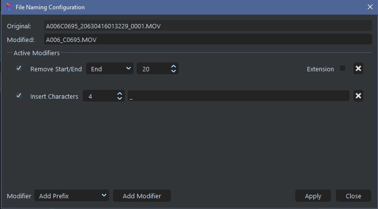
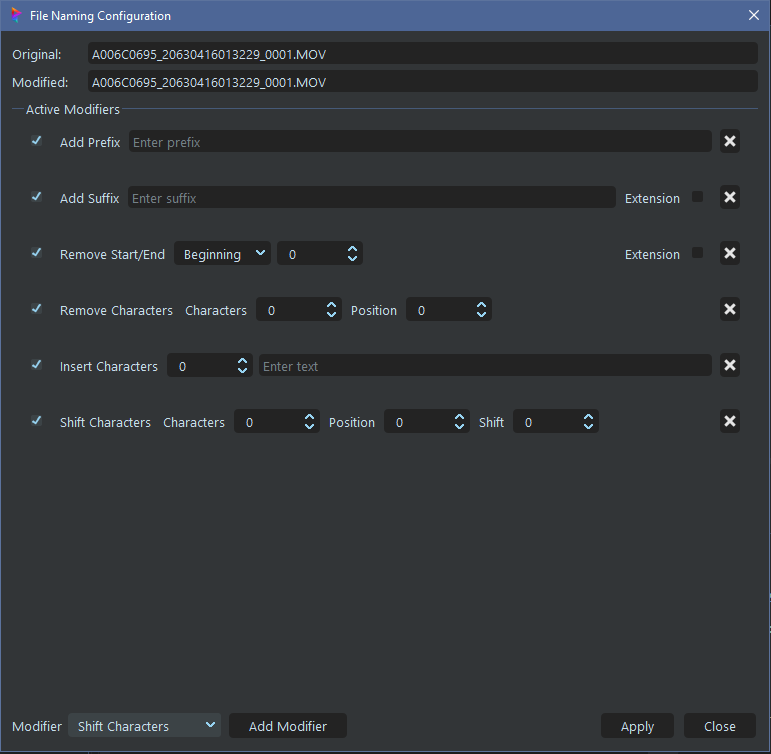

# **File Naming**

 

Camera manufactures all seem to have their own naming formats - some which are bad, and some just less bad.  SourceTab has file re-naming functions built-in using name-text modifiers.

Each Modifier will alter the file name from the top to the bottom.  Multiple Mods can be used to build any pipeline's naming structure.

**NOTE:** This will not edit the file's Metadata, so the original file name will still exist in the file.  In addition, the orginal file name will be included with any Metadata sidecar files generated.

 

##  File Naming Window

- **Original:**  Un-altered file name.

- **Modified:**  File name after all enabled Modifiers.

- **Active Modifiers:** List of Modifiers in order.

- **Add Modifier:** Adds the Modifier type selected in the dropdown.  Multiple copies of each type can be added to the Mod list.

- **Checkbox:** Enabled/Disable the Modifier.  This will keep it in the list, but disable its function.

- **Delete:** Clicking the X button will remove the Modifier from the list.

 

## Available Modifiers

**Add Prefix**
 
Adds text to beginning of name.

**Add Suffix**
 
Adds text to end of name. Use *extension* if desired.

**Remove Start/End**
 
Removes number of *charactors* from the *start* or *end* of the name.

**Remove Charactors**
 
Removes number of *charactors* starting at *position*

**Insert Charactors**
 
Inserts text into name at position

**Shift Charactors**
 
Shifts *charactors* starting at *position* to the left (negative) or right (positive)

 

___
jump to:

[**Installation**](Doc-Installation.md)

[**Settings**](Doc-Settings.md)

[**Interface**](doc-Interface.md)

[**Proxys**](Doc-Proxys.md)

[**Metadata**](Doc-Metadata.md)