# **Interface**

 

## **Quick Index**

[**Source Browser**](#source-browser) 
[**File Tile**](#file-tiles) 
[**Preview Player**](#preview-viewer) 
[**Functions Panel**](#functions-panel) 
[**Transfer Popup**](#transfer-popup) 
[**Transfer Report**](#transfer-report) 
[**Sidecar Files**](#sidecar-files) 
[**Drag / Drop**](#drag--drop) 
[**Keyboard Shortcuts**](#keyboard-shortcuts-hotkeys) 

 

## **Basic Transfer Flow**

- Source:
    - Source Directory is added to Source Panel
    - for Each File:
        - Scanned to get its details (frames, size, etc) and Metadata
        - Hashed for future reference.
        - Scanned for a associated Proxy
        - Thumbnail generated
        - A File Tile is constructed and displayed in the Source Panel

- Destination:
    - Destination Directory is added to Destination Panel
    - Desired Files added from Source to Destination
    - Files to be transferred checked

- Functions Panel:
    - Proxy Handling configured
    - File Naming configured
    - Metadata configured

- Transfer is Initiated with the *Start Transfer* button
    - All Checked File Tiles are put in Queue for transfer 
    - Checked File Tile's Mainfile are copied in parallel (up to max workers [default is 5])

- After Mainfile transfer is complete:
    - The transferred file is hashed
    - Source and Destination's file's hashes are compared
    - If Source Proxy exists it is added to the transfer queue (if applicable), or
    - Proxy generation job is added to the queue (if applicable)

- After the Proxy is complete, its hash is compared (if applicable)

- After all File's have been completed
    - Transfer Report is generated (if enabled)
    - Metadata Sidecar file(s) are generated (if enabled)
    - Complete sound and popup are displayed (if enabled)

## **Source Browser**

 

## **File Tiles**

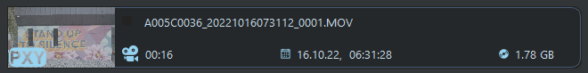

Each file is represented by a File Tile.  This is aimed to quickly display each file and its relevant information.

 

### **Details**
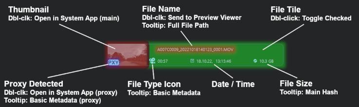 
File Tiles have additional functionality and Tooltips

 

### **Right-click Menu**

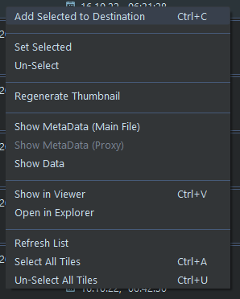&nbsp;&nbsp;&nbsp;&nbsp;&nbsp;&nbsp;&nbsp;&nbsp;
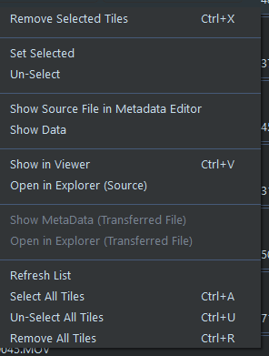

(see [**Shortcuts**](#keyboard-shortcuts-hotkeys) below)

## **Preview Viewer**

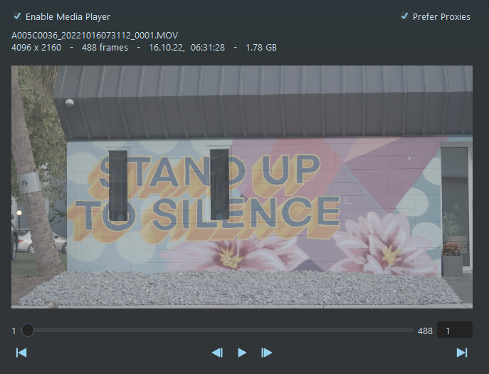

### **Right-click Menu**

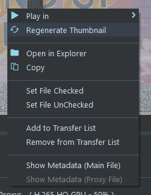

## **Functions Panel**

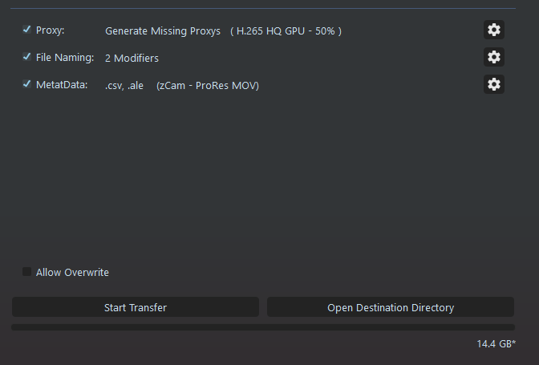

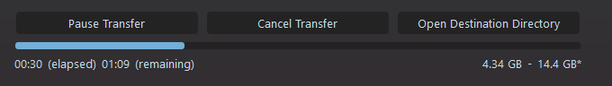

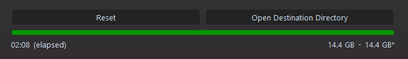

## **Transfer Popup**

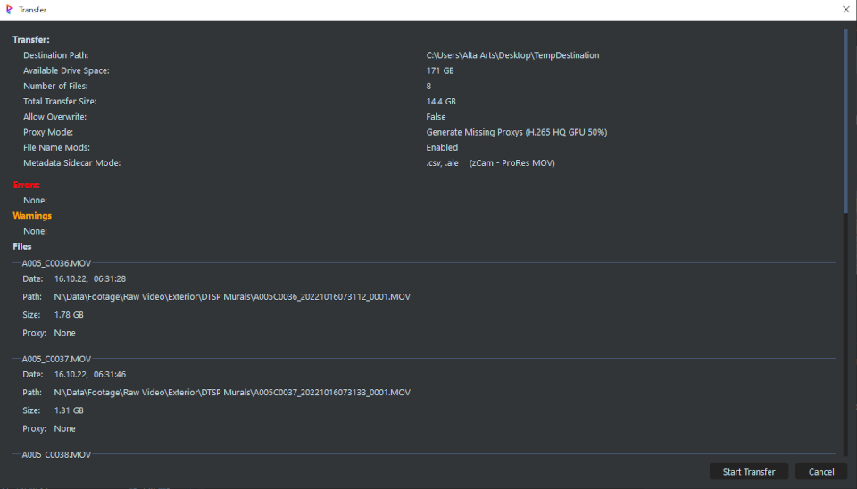

## **Transfer Report**

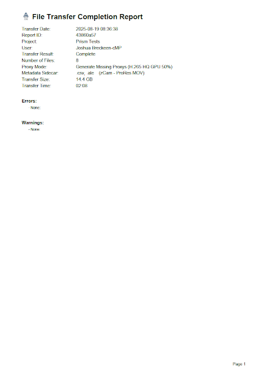&nbsp;&nbsp;&nbsp;&nbsp;&nbsp;&nbsp;&nbsp;
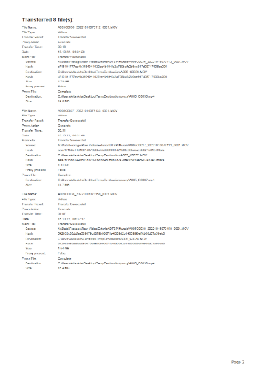

## **Sidecar Files**

## **Drag / Drop**

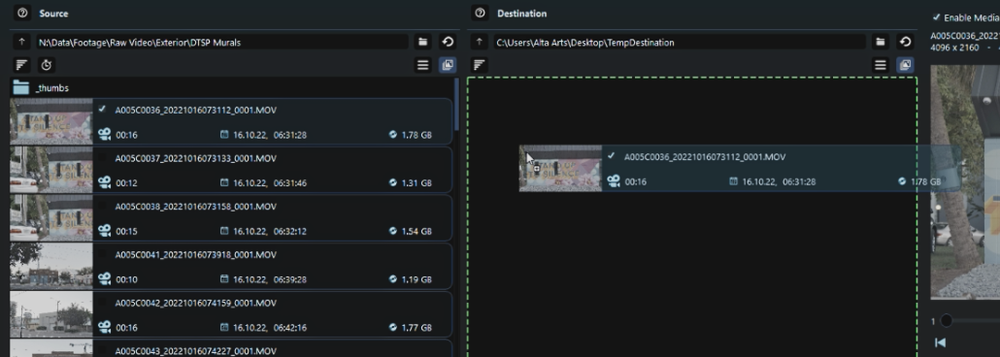

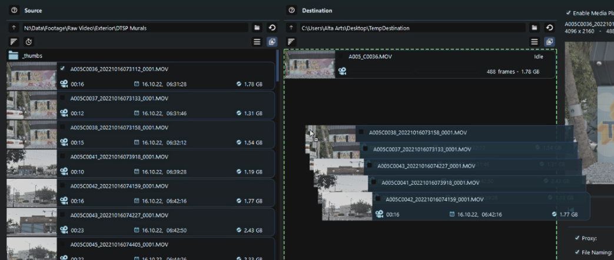

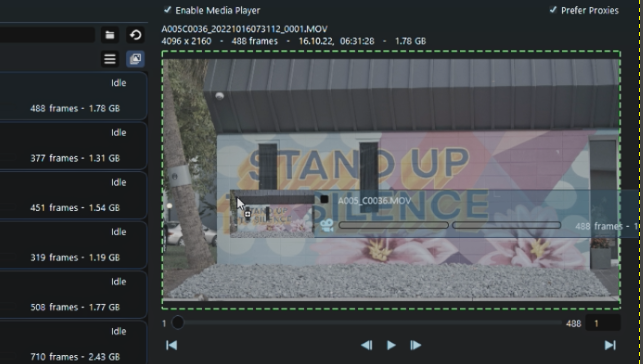

## **Keyboard Shortcuts (Hotkeys)**

 

___
jump to:

[**Installation**](Doc-Installation.md)

[**Settings**](Doc-Settings.md)

[**Proxys**](Doc-Proxys.md)

[**File Naming**](Doc-FileNaming.md)

[**Metadata**](Doc-Metadata.md)
