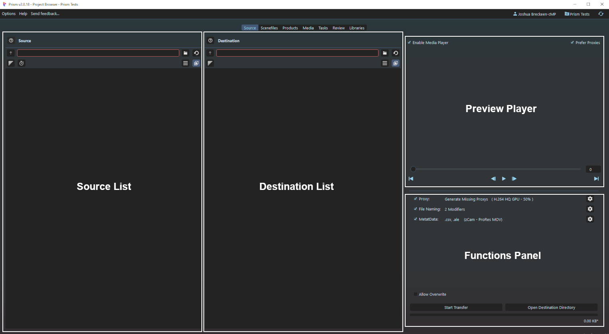
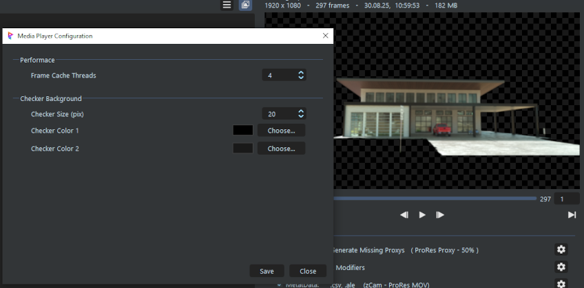
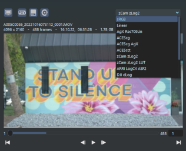
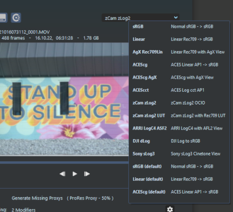
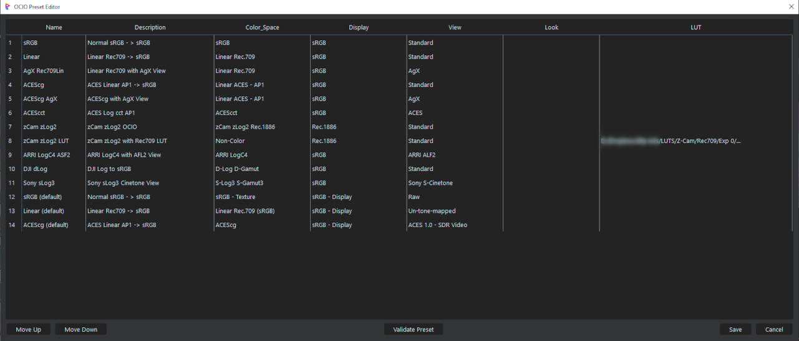
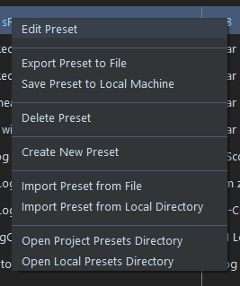
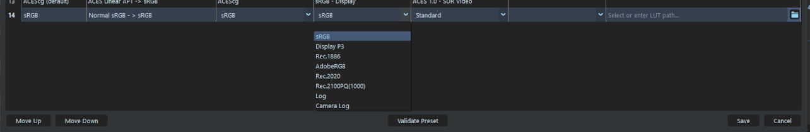
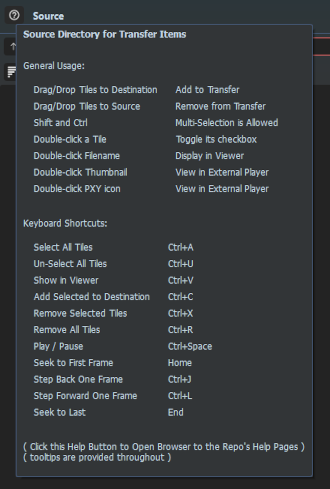

# **Interface**

 

## **Quick Index**

[**Source Browser**](#source-browser) 
[**File Tile**](#file-tiles) 
[**Preview Player**](#preview-player) 
[**Player Settings**](#player-settings) 
[**OCIO Presets**](#ocio-presets) 
[**OCIO Presets Editor**](#ocio-presets-editor) 
[**Functions Panel**](#functions-panel) 
[**Transfer Popup**](#transfer-popup) 
[**Transfer Report**](#transfer-report) 
[**Sidecar Files**](#sidecar-files) 
[**Drag / Drop**](#drag--drop) 
[**Keyboard Shortcuts**](#keyboard-shortcuts-hotkeys) 

 

## **Basic Transfer Flow**
This is a simple overview of a typical transfer job:
- Source:
    - Source Directory is added to Source Panel
    - then each File is:
        - Scanned to get its details (frames, size, etc) and Metadata
        - Hashed for transfer error checking.
        - Scanned for a associated Proxy
        - Thumbnail generated
        - A File Tile is constructed and displayed in the Source Panel

- Destination:
    - Destination Directory is added to Destination Panel
    - Desired Files added from Source to Destination
    - Files to be transferred checked

- Functions Panel:
    - Proxy Handling configured
    - File Naming configured
    - Metadata configured

- Transfer is Initiated with the *Start Transfer* button
    - All Checked File Tiles are put in Queue for transfer 
    - Checked File Tile's Mainfile are copied in parallel (up to max workers [default is 6])

- After Mainfile transfer is complete:
    - The transferred file is hashed
    - Source and Destination's file's hashes are compared
    - If Source Proxy exists it is added to the transfer queue (if applicable), or
    - Proxy generation job is added to the queue (if applicable)

- After the Proxy is complete, its hash is compared (if applicable)

- After all File's have been completed
    - Transfer Report is generated (if enabled)
    - Metadata Sidecar file(s) are generated (if enabled)
    - Complete sound and popup are displayed (if enabled)

 

## **Source Browser**

The main window is the SourceBrowser in the "Source" tab.  The SourceTab plugin will add the tab to the main Prism Project Browser top bar, in the position set in the [**Settings**](Doc-Settings.md/#sourcetab-project-settings).

There are 4 main panels that make up the SourceBrowser:
- **Source List:**  displays all the files in the Source Directory.  
- **Destination List:** holds added File Tiles for transfer.
- **Preview Player:** plays the selected media for review.
- **Functions Panel:** transfer-specific configuration options.

### **Icons**

 **Help:**  Hovering will display quick details.  Clicking will open the Web Browser to the SourceTab Documentation on GitHub. 
 **Up:** go up one directory level. 
 **Explorer:** open the File Explorer to select the directory (or optionally in the Destination side will open the Libraries popup to choose a directory). 
 **Refresh:** reload the File Tiles. 
 **Sorting:** open the Sorting Menu for the list. 
 **Frames Display:** toggle frames/duration display in the File Tile. 
 **Filters:** enables filtering of File Tiles. Click to toggle enabled, right-click for the Filters Menu. 
 **Group Sequences:** toggle grouping of image sequences into one File Tile.

 

## **File Tiles**

Each file (or Image Sequence) is represented by a File Tile.  This is aimed to quickly display each file and its relevant information.  File Tiles contain the file's information and have additional functionality (**see below**).

File Tiles can be added from the Source to the Destination by several ways including [Drag/Drop](#drag--drop), [Keyboard Shortcuts](Doc-Interface.md/#keyboard-shortcuts-hotkeys), and through the [Right-click Menu](#right-click-menu).

 

### **Details**
File Tiles have additional functionality and Tooltips to help in quick viewing and handling.

 

 

### **Right-click Menu**

&nbsp;&nbsp;&nbsp;&nbsp;&nbsp;&nbsp;&nbsp;&nbsp;

(see also [Shortcuts](#keyboard-shortcuts-hotkeys) below)

 

## **Preview Player**

SourceTab includes an improved version of the Media Player that targets video playback performance by utilizing pre-caching.

 **Enable:**  Enables/Disables the Preview Player Window. 
 **Prefer Proxys:**  If enabled, will display the associated Proxy of the media in the Player. 
 **Cache:**  Enables/Disables the automatic pre-caching. 
 **OCIO:**  Enables/Disables the OCIO transforms in the Preview Player. 

#### **Prefer Proxys** ####

Hopefully camera-original video files (dailies/rushes) will come with proxy versions.  If an associated Proxy has been discovered by SourceTab, it can be used in the Preview Player display to speed up loading and a small "PXY" icon will be shown in the viewer (similar to many DCC's).  If there is no proxy, or the option is disabled the original media will be displayed.  This has no affect to the actual transfered file(s).

#### **Cache** ####

To speed up Preview Player media playback, as pre-cache system has been implemented.  If enabled, when a media file is loaded into the viewer it will be cached to the system's RAM automatically using threaded workers (see [Player Settings](#player-settings) below).  The caching will be displayed as a progress bar in the Timeline slider.

#### **OCIO** ####

The Preview Player can display the media using the system's OCIO config transforms.  SourceTab implements user-editable OCIO presets that are selected in the dropdown, and can be added/edited/removed in the OCIO Presets popup (see [OCIO Presets](#ocio-presets) below).

#### **Right-click Menu**

 

### **Player Settings** ###

From the Preview Player right-click menu, a user can configure the Player options:
- **Frame Cache Threads:** Number of threads used for the caching (optimal number depends on the systems RAM, network bandwidth, and number of CPU's)
- **Checker Background:** For display of images with alpha (transparency), a checkerboard background is displayed to allow a user to see the alpha.  The size and colors of the checkerboard can be configured as desired.

 

### **OCIO Presets** ###

The SourceTab Preview Player uses OCIO presets for quick colorspace corrections for media display.  This uses the specified OCIO config file that the system is running (ie system's OCIO variable or Prism's Media Extension).  OCIO Presets are selected with the dropdown combobox above the viewer (if enabled), which allows settings quick and easy.  All available Presets will be displayed in the tooltip by hovering over the dropdown.

&nbsp;&nbsp;&nbsp;&nbsp;&nbsp;&nbsp;&nbsp;&nbsp;

### **OCIO Presets Editor** ###

Editing Presets is done in the OCIO Preset Editor from the Player's right-click menu.  The order of the Presets in the Editor will control the order of the Player's OCIO dropdpown (can be changed with the Up/Down buttons).  Also Presets can be validated with the button at the bottom.

### Right-click Menu

Right-clicking in the Presets Editor will bring up context menus with extra functionality.

- **Edit Preset*** Switches the selected Preset to Edit Mode (see [Edit Mode](#edit-mode) below).

- **Export Preset to File:** Opens File Explorer to save the selected Preset using the Preset name with an extension ".o_preset"

- **Save Preset to Local Machine:** Saves the selected Preset to the local plugin presets directory. This allows both backup, and future use in other projects.

- **Delete Preset:** Deletes the selected Preset from the Project. If the Preset is in the Local plugin dir or elsewhere, it will not delete those.

- **Create New Preset from Current:** Adds new empty Preset and switches to Edit Mode (see [Edit Mode](#edit-mode) below).

- **Import Preset from File:** Opens File Explorer to allow import of a ".o_preset" file.

- **Import Preset from Local Dir:** Opens the local plugin presets dir to import a Preset.

- **Open Project Presets Dir:** Opens the Project Presets dir in Explorer.

- **Open Local Presets Dir:** Opens the local plugin presets dir in Explorer.

 

### **Edit Mode** ###
When selecting *Edit Preset*, the selected row will switch to edit mode.  Edit mode makes the text fields editable, and enables dropdowns for the transforms which are populated from the system's OCIO config file.

- **Name**: The name for the presets. Used in the menus and will be the preset file name with a ".o_preset" extension.

- **Description**: Short blurb describing the preset. Used for reference in the tooltip.

- **ColorSpace**: The 'colorspace' the image is saved in (ie: sRGB, Linear, ACEScg, etc).

- **Display**: The monitor's display profile (usually sRGB).

- **View**: The OCIO View transform.

- **Look**: Optional OCIO Look transform

- **LUT**: Optional LUT filepath.  This can be selected with the Explorer button, or the full filepath pasted into the field.

        NOTES:
        - Preset Name (max 20 characters and "normal" file system symbols - not allowed: \ / : * ? " < > |)
        - LUT files will be applied after the other OCIO transforms (meaning at the end of the chain)

 

## **Functions Panel**

The Functions Panel displays the main transfer settings, and allows the configuration of such.

see [**Proxys**](Doc-Proxys.md) 
see [**File Naming**](Doc-FileNaming.md) 
see [**Metadata**](Doc-Metadata.md)

 

The buttons at the bottom control the Transfer process, and display the status and progress of the job.

 

## **Transfer Popup**

At the start of the Transfer, a popup window will be displayed detailing the Transfer.  This allows the user to see an overview of the transfer job, and see any warnings or errors that may be found.

 

## **Transfer Report**

If enabled in the settings, a .PDF report will be generated detailing the transfer.  This report will be saved in the selected Destination directory, and contains information such as the Source and Destination size, type, hash, and completion status.  This can be used for future reference of the transfer. 
(see [**Settings**](Doc-Settings.md/#completion--report))

&nbsp;&nbsp;&nbsp;&nbsp;&nbsp;&nbsp;&nbsp;

 

## **Sidecar Files**

If enabled and selected, Metadata side-car files can be generated at the completion of the transfer.  These side-car files can be used to import the metadata into the desired editing DCC, and will be saved into the selected Destination directory. 
(see [**Metadata**](Doc-Metadata.md/#sidecar-generation))

 

## **Drag / Drop**

SourceTab can use Drag/Drop to perform various actions in the interface.

- Dragging a file/folder into the Source Panel will add the directory as the Source, and populate the list.
    - (same as clicking the Source File Explorer and choosing a directory)
- Dragging a folder into the Destination Panel will select that directory as the Destination.
    - (same as clicking the Destination File Explorer and choosing a directory)
- Dragging a Source File Tile to Destination panel will add it to the Destination list.
    - (same as *Add Selected to Destination* menu item)
- Dragging a Destination File Tile to the Source Panel will remove it from the Destination list
    - (same as *Remove Selected Tiles* menu item)
- Dragging a File Tile to the Preview Viewer will display it in the Viewer.
    - (same as double-clicking the Tile name or the *Show in Viewer* menu item)

 

## **Keyboard Shortcuts (Hotkeys)**

To speed up workflows, keyboard shortcuts have been implemented in the SourceTab window.  This can speed up selection and viewing the media.

Currently implemented shortcuts can be viewed next to the associate command in the menus, and a full list is displayed in the Help tooltip (see [**Help**](#icons)).

&nbsp;&nbsp;&nbsp;&nbsp;&nbsp;&nbsp;&nbsp;&nbsp;

    At present there is no configurtion of the shortcuts or their actions.

 

___
jump to:

[**Table of Contents / Index**](Doc-Docs_TOC.md) 

[**Installation**](Doc-Installation.md) 
[**Settings**](Doc-Settings.md) 
[**Proxys**](Doc-Proxys.md) 
[**File Naming**](Doc-FileNaming.md) 
[**Metadata**](Doc-Metadata.md) 
