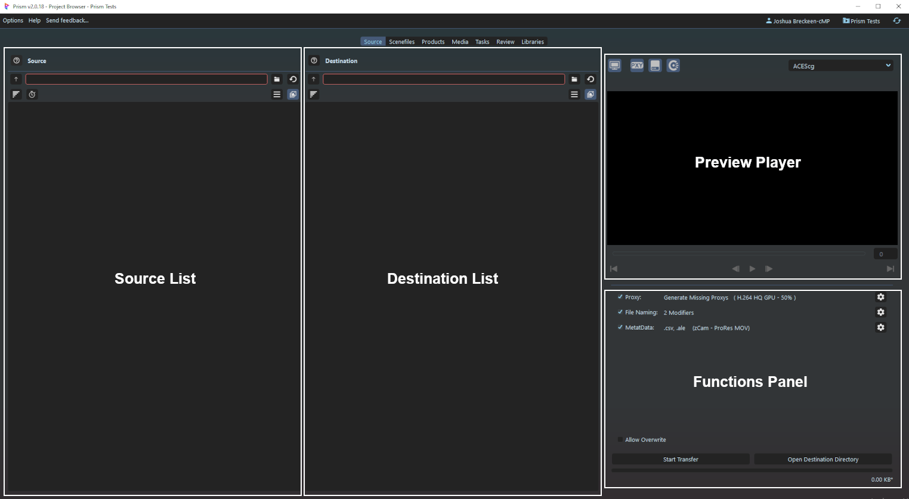
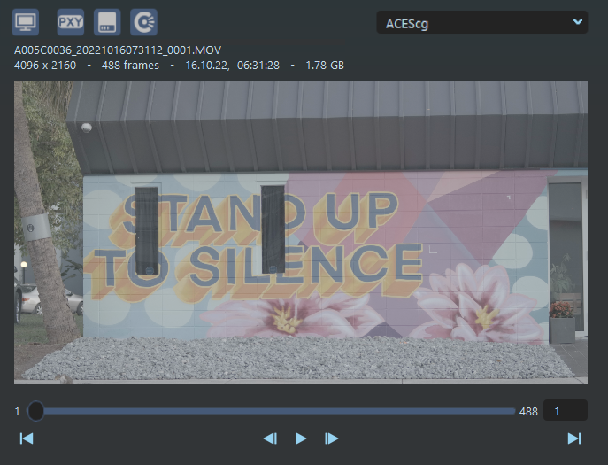
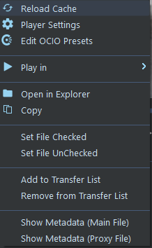

# **Interface**

 

## **Quick Index**

[**Source Browser**](#source-browser) 
[**File Tile**](#file-tiles) 
[**Preview Player**](#preview-viewer) 
[**Functions Panel**](#functions-panel) 
[**Transfer Popup**](#transfer-popup) 
[**Transfer Report**](#transfer-report) 
[**Sidecar Files**](#sidecar-files) 
[**Drag / Drop**](#drag--drop) 
[**Keyboard Shortcuts**](#keyboard-shortcuts-hotkeys) 

 

## **Basic Transfer Flow**
This is a simple overview of a typical transfer job:
- Source:
    - Source Directory is added to Source Panel
    - then each File is:
        - Scanned to get its details (frames, size, etc) and Metadata
        - Hashed for future reference.
        - Scanned for a associated Proxy
        - Thumbnail generated
        - A File Tile is constructed and displayed in the Source Panel

- Destination:
    - Destination Directory is added to Destination Panel
    - Desired Files added from Source to Destination
    - Files to be transferred checked

- Functions Panel:
    - Proxy Handling configured
    - File Naming configured
    - Metadata configured

- Transfer is Initiated with the *Start Transfer* button
    - All Checked File Tiles are put in Queue for transfer 
    - Checked File Tile's Mainfile are copied in parallel (up to max workers [default is 6])

- After Mainfile transfer is complete:
    - The transferred file is hashed
    - Source and Destination's file's hashes are compared
    - If Source Proxy exists it is added to the transfer queue (if applicable), or
    - Proxy generation job is added to the queue (if applicable)

- After the Proxy is complete, its hash is compared (if applicable)

- After all File's have been completed
    - Transfer Report is generated (if enabled)
    - Metadata Sidecar file(s) are generated (if enabled)
    - Complete sound and popup are displayed (if enabled)

 

## **Source Browser**

The main window is the SourceBrowser in the "Source" tab.  The SourceTab plugin will add the tab to the main Prism Project Browser top bar, in the position set in the [**Settings**](Doc-Settings.md/#sourcetab-project-settings).

There are 4 main panels that make up the SourceBrowser:
- **Source List:**  displays all the files in the Source Directory.  
- **Destination List:** holds added File Tiles for transfer.
- **Preview Player:** plays the selected media for review.
- **Functions Panel:** transfer-specific configuration options.

### **Icons**

 **Help:**  Hovering will display quick details.  Clicking will open the Web Browser to the SourceTab Documentation on GitHub. 
 **Up:** go up one directory level. 
 **Explorer:** open the File Explorer to select the directory (or optionally in the Destination side will open the Libraries popup to choose a directory). 
 **Refresh:** reload the File Tiles. 
 **Sorting:** open the Sorting Menu for the list. 
 **Frames Display:** toggle frames/duration display in the File Tile. 
 **Filters:** enables filtering of File Tiles. Click to toggle enabled, right-click for the Filters Menu. 
 **Group Sequences:** toggle grouping of image sequences into one File Tile.

 

## **File Tiles**

Each file is represented by a File Tile.  This is aimed to quickly display each file and its relevant information.  File Tiles contain the file's information and have additional functionality (**see below**).

File Tiles can be added from the Source to the Destination by several ways including [**Drag/Drop**](#drag--drop), [**Keyboard Shortcuts**](Doc-Interface.md/#keyboard-shortcuts-hotkeys), and through the [**Right-click Menu**](#right-click-menu).

 

### **Details**
File Tiles have additional functionality and Tooltips to help in quick viewing and handling.

 

 

### **Right-click Menu**

&nbsp;&nbsp;&nbsp;&nbsp;&nbsp;&nbsp;&nbsp;&nbsp;

(see [**Shortcuts**](#keyboard-shortcuts-hotkeys) below)

## **Preview Viewer**

### **Right-click Menu**

## **Functions Panel**

## **Transfer Popup**

## **Transfer Report**

&nbsp;&nbsp;&nbsp;&nbsp;&nbsp;&nbsp;&nbsp;

## **Sidecar Files**

## **Drag / Drop**

## **Keyboard Shortcuts (Hotkeys)**

 

___
jump to:

[**Table of Contents / Index**](Doc-Docs_TOC.md) 

[**Installation**](Doc-Installation.md) 
[**Settings**](Doc-Settings.md) 
[**Proxys**](Doc-Proxys.md) 
[**File Naming**](Doc-FileNaming.md) 
[**Metadata**](Doc-Metadata.md) 
