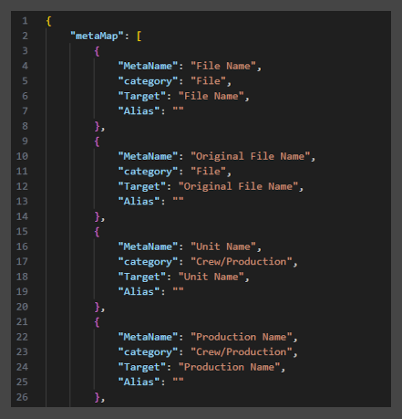

# **Metadata**

<br>

Unfortunately there seems to be no standard for Metadata throughout the industry.  Each Camera manufacturer and Studio pipeline have their own ideas on what data is saved, to what key it is saved to, and even the type of file used.  And DCC's do not help by limiting Metadata Import/Export types.

But since Metadata can be such a useful piece in the data flow, SourceTab tries to make Metadata as flexible as possible.  Metadata will be read from each video file using a combination of FFprobe (part of the FFmpeg tools see [FFmpeg](https://github.com/FFmpeg/FFmpeg)), and ExifTool (see [ExifTool](https://github.com/exiftool/exiftool)).  The Metadata will be read from the file, and the user can target Metadata fields with that data (see [Configuring](#configuring) below).


Metadata handling is enabled by setting the Metadata checkbox in the SourceTab Functions panel.  The selected Sidecar types and Preset will be displayed for quick reference.  The cog button will open the Metadata Editor window.

<br>

```
NOTE: Some camera manufactures use proprietary Metadata tokens, especially with their custom "raw" formats.  As of now, FFprobe and ExifTool cannot get all the data from these types of files.
```

<br>

## **Metadata Editor**


The Metadata Editor allows a user to configure Metadata fields ("Field") with either data from the video file, or enter custom data.  

<br>

### Configuring

The Metadata Editor is used to configure the various Metadata fields with the desired values.  Each Field can be enabled/disabled with its checkbox, and disabled Fields (or NONE) will not be written to the Sidecar files.

Each Field's value can be configured using the dropdown in each Field's *Source* column:

**NONE:**<br>
<br>
This will effectively disable the Field and will leave the Field data empty.  

**Global (user entered):**<br>
<br>
The value entered into the *Current* cell will be used for all the transferred files.

**Unique (user entered):**<br>
<br>
The value entered into the *Current* cell will be used only for the currently viewed file.  This allows different values for each file, such as scene/shot info, as well as comments etc.

**Source Metadata (from file's metadata):**<br>
<br>
This will use the data from each file that is read by the SourceTab plugin (FFmpeg and ExifTool).  The data displayed will be updated for each viewed file.

Every Metadata key will be grouped and displayed in the dropdown:<br>


<br>

```
NOTE: Due to Qt's selection behavior, you must first click on the cell to select it, and then click it again to edit.
```

<br>

### Files Dropdown


Each file in the Destination panel of the SourceTab main UI will be loaded into the Metadata Editor.  The file currently listed in the dropdown will have its Metadata displayed in the Editor.  Changing the current file will update the Editor to display the file's Metadata.

<br>

### Filters


The Metadata Editor has filtering functionality that allows the user to show/hide fields as desired.  To enable filtering, toggle the filter button on.  By default nothing will change since there are no filters enabled.  Right-clicking the button will display a menu to allow show/hiding of Fields:

- **Hide Disabled:** Show/Hide Fields according to their *Enabled* checkbox.
- **Hide Empty:** Show/Hide fields that are "NONE"
- **Category Checkboxes:** Show/Hide each of the Metadata category types

<br>

### Metadata Viewer


Clicking the *View Metadata* button will display the current file's Metadata in the popup viewer (the same as the right-click menu action of a File Tile).  This allows viewing the complete raw Metadata for a file, and can be used for reference when configuring the Editor.

<br>

### Metadata Presets


Allows for quick configuration from saved Metadata Presets.  Since Metadata varies widely from camera to camera, and even shoot to shoot, users are encouraged to create and use their own Presets.  For example Presets can be made for specific cameras, formats, shows, and/or projects.

 Clicking the *Edit* button will open the Metadata Presets List (see [Presets List](#presets-list) below).

<br>

### Sidecar Menu


Clicking the *Metadata Sidecar Types* button at the bottom will open a small menu to select which Sidecar file types are created during a transfer (see [Sidecar Generation](#sidecar-generation) below).

#### Generate Sidecar Now (optional):
Sidecar files are normally generated at the end of a transfer.  This will generate the selected Sidecar file types immediately using the data from the files in the Destination Panel, and save to the selected Destination directory.  This can be used to generate Sidecars without an actual transfer.

<br>

## **Presets List**


Presets are small text (json) files with an extension **".m_preset"** that contains the Metadata mapping.  

This lists all the Metadata Presets in the current Prism Project (presets are saved to the project).  Using the right-click menu, Presets can be imported/exported from other projects and shared with other users.  In addition to that, Presets can be saved in a Prism Project Template.

The order of the Presets in the list determines the order in the dropdown.


### Right-click Menu


Right-clicking in the Presets window will bring up context menus with extra functionality.

- **Edit Preset*** Opens the Preset Editor to manually edit the json text of the Preset (see [Preset Editor](#metadata-preset-editor) below).

- **Export Preset to File:** Opens File Explorer to save the selected Preset using the Preset name with an extension ".m_preset"

- **Save Preset to Local Machine:** Saves the selected Preset to the local plugin presets directory. This allows both backup, and future use in other projects.

- **Delete Preset:** Deletes the selected Preset from the Project. If the Preset is in the Local plugin dir or elsewhere, it will not delete those.

- **Create New Preset from Current:** Opens the Preset Editor and populates it with the current Metadata configuration (see [Preset Editor](#metadata-preset-editor) below).

- **Import Preset from File:** Opens File Explorer to allow import of a ".m_preset" file.

- **Import Preset from Local Dir:** Opens the local plugin presets dir to import a Preset.

- **Open Project Presets Dir:** Opens the Project Presets dir in Explorer.

- **Open Local Presets Dir:** Opens the local plugin presets dir in Explorer.

<br>

## **Metadata Preset Editor**


The selected Preset (or empty current) will be displayed in the Editor, with its name in the *Preset Name* box, and its data in the text box.  A Preset's data is json text with each Field's data (if enabled and not None).

The Preset can be manually edited using the Preset Editor, and some text validation is implemented to try and mitigate mistakes:

- **Preset Name:** Max of 30 chars and use "normal" file system symbols (not allowed: \\ / : * ? \" < > |)

- **Preset Data:** - Valid json that is a list of dictionaries.  Each dictionary must have these key/value pairs:
    - "field": string
    - "enabled": bool
    - "sourceField": string
    - "currentData": string

<br>

##  **Sidecar Generation**

Currently Metadata generated by SourceTab will not alter the video files themselves, but will create new separate files known as Sidecars.  These Sidecar files are to be used in conjunction with the original files to carry additional information.

During a transfer (if enabled) the selected Sidecar files will be generated using the configuration in the Metadata Editor using each transferred file's Metadata.

As of now, two types of Metadata Sidecar files can be generated:
- DaVinci Resolve (.csv)
- Avid (.ale)

<br>

```
NOTE: Please request additional Sidecar types via the Github Repo.  Will be happy to try and implement if possible.
```
```
NOTE: There was internal discussion about adding Metadata into the video files themselves.  It would be a cool thing to do, but it was decided that altering camera files (Dailies/Rushes) may not be the best and it was decided to not do.  But please let us know if that is a desired feature.
```

<br>

##  **Deeper Control**

The SourceTab Metadata Editor gets its structure from a plugin file named "MetaMap.json" that is in PLUGINPATH\Libs\UserInterfaces:



This file is parsed by SourceTab and used to dynamically build the various Metadata Fields and Categories.  This means a power user may edit this file to add/edit/remove Fields or Categories as desired (it should work, fingers crossed!).

By default, there are 5 Categories:
- File (hardcoded to be first and not shown in the Filters menu)
- Crew/Production
- Shot/Scene
- Camera
- Audio

When additional Fields or Categories are added, they should show up in the order they appear in MetaMap.json.

```
NOTE: As of now, the "Alias" key/value pair is not used.  It is included for future needs.
```

<br>

___
jump to:

[**Table of Contents / Index**](Doc-Docs_TOC.md)<br>

[**Installation**](Doc-Installation.md)<br>
[**Settings**](Doc-Settings.md)<br>
[**Interface**](Doc-Interface.md)<br>
[**Proxys**](Doc-Proxys.md)<br>
[**File Naming**](Doc-FileNaming.md)<br>
