# **Metadata**

<br>

Unfortunately there seems to be no standard for Metadata throughout the industry.  Each Camera manufacturer and Studio pipeline have their own take on what data is saved, what key it is saved to, and even the type of file used.  And DCC's do not help by limiting Metadata Import/Export types.

But since Metadata can be such a useful piece in the data flow, SourceTab tries to make Metadata as flexible as possible.  Metadata will be read from each video file using a combination of FFprobe (part of the FFmpeg tools see [FFmpeg](https://github.com/FFmpeg/FFmpeg)), and ExifTool (see [ExifTool](https://github.com/exiftool/exiftool)).  The Metadata will be read from the file, and the user can target Metadata fields with that data (see [Configuring](#configuring) below).

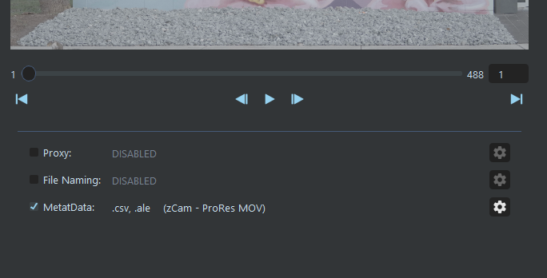

Metadata handling is enabled by setting the Metadata checkbox in the SourceTab Functions panel.  The selected Sidecar types and Preset will be displayed for quick reference.  The cog button will open the Metadata Editor window.

<br>

## **Metadata Editor**

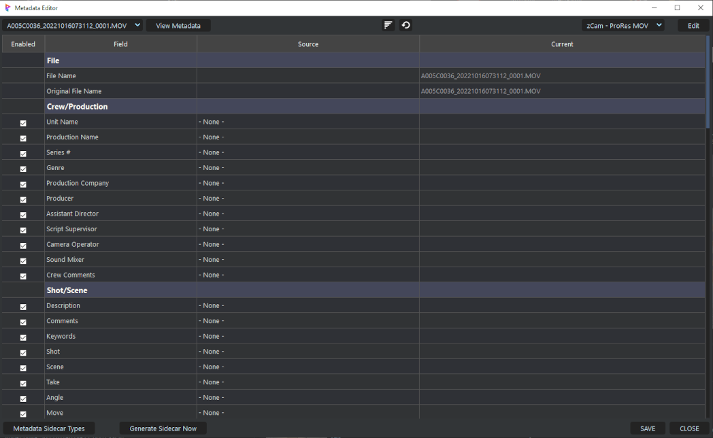

The Metadata Editor allow a user to configure Metadata fields ("Field") with either data from the video file, or enter custom data.  

<br>

### Configuring

The Metadata Editor is used to configure the various Metadata fields with the desired values.  Each Field can be enabled/disabled with its checkbox, and disabled Fields (or NONE) will not be written to the Sidecar files.

Each Field's value can be configured using the dropdown in each Field's *Source* column:

**NONE:**<br>
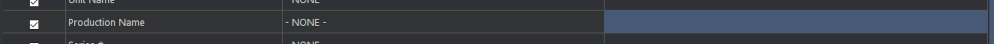<br>
This will effectively disable the Field and will leave the Field data empty.  

**Global (user entered):**<br>
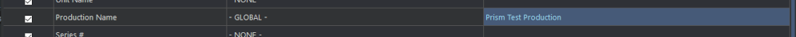<br>
The value entered into the *Current* cell will be used for all the transferred files.

**Unique (user entered):**<br>
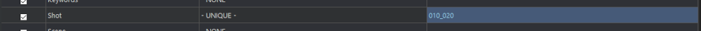<br>
The value entered into the *Current* cell will be used only for the currently viewed file.  This allows different values for each file, such as scene/shot info, as well as comments etc.

**Source Metadata (from file's metadata):**<br>
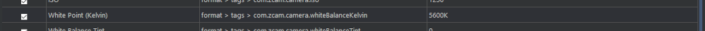<br>
This will use the data from each file that is read by the SourceTab plugin (FFmpeg and ExifTool).  The data displayed will be updated for each viewed file.

Every Metadata key will be grouped and displayed in the dropdown:<br>

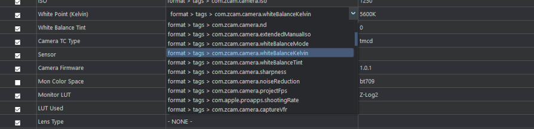

<br>

```
NOTE: Due to Qt's selection behavior, you must first click on the cell to select it, and then click it again to edit.
```


<br>

### Files Dropdown
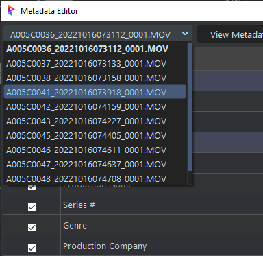

Each file in the Destination panel of the SourceTab main UI will be loaded into the Metadata Editor.  The file currently listed in the dropdown will have its Metadata displayed in the Editor.  Changing the current file will update the Editor to display the file's Metadata.

<br>

### Filters
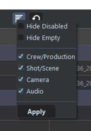

The Metadata Editor has filtering functions that allow the user to show/hide fields as desired.  To enable filtering, toggle the filter button on.  By default nothing will change since there are no filters enabled.  Right-clicking the button will display a menu to allow show/hiding of Fields:

- **Hide Disabled:** Show/Hide Fields according to their *Enabled* checkbox.
- **Hide Empty:** Show/Hide fields that are "NONE"
- **Category Checkboxes:** Show/Hide each of the Metadata category types

<br>

### Metadata Viewer
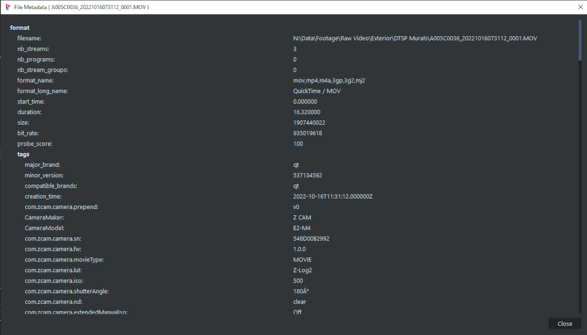

Clicking the *View Metadata* button will display the current file's Metadata in the popup viewer (the same as the right-click menu action of a File Tile).  This allows viewing the complete raw Metadata for a file, and can be used for reference when configuring the Editor.

<br>

### Metadata Presets
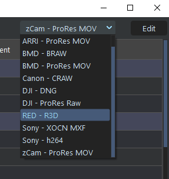

Allows for quick configuration from saved Metadata Presets.  Clicking the *Edit* button will open the Metadata Presets List (see [Presets List](#presets-list) below).

<br>

### Sidecar Menu
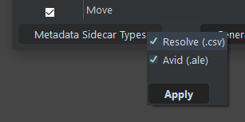

Clicking the *Metadata Sidecar Types* button at the bottom will open a small menu to select which Sidecar file types are created during a transfer.

#### Generate Sidecar Now (optional):

Sidecar files are normally generated at the end of a transfer.  This will generate the selected Sidecar file types immediately using the data from the files in the Destination Panel, and save to the selected Destination directory.  This can be used to generate Sidecars without an actual transfer.


<br>


## **Presets List**

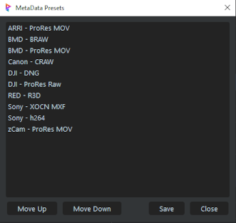

ORDER of Presets

### Right-click Menu
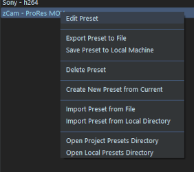

Right-clicking in the Presets window will bring up context menus with extra functionality.

- **Edit Preset*** Opens the Preset Editor to manually edit the json text of the Preset (see [Preset Editor](#metadata-preset-editor) below).

- **Export Preset to File:** Opens File Explorer to save the selected Preset using the Preset name with an extension ".m_preset"

- **Save Preset to Local Machine:** Saves the selected Preset to the local plugin presets directory. This allows both backup, and future use in other projects.

- **Delete Preset:** Deletes the selected Preset from the Project. If the Preset is in the Local plugin dir or elsewhere, it will not delete those.

- **Create New Preset from Current:** Opens the Preset Editor and populates it with the current Metadata configuration (see [Preset Editor](#metadata-preset-editor) below).

- **Import Preset from File:** Opens File Explorer to allow import a ".m_preset" file.

- **Import Preset from Local Dir:** Opens the local plugin presets dir to import a Preset.

- **Open Project Presets Dir:** Opens the Project Presets dir in Explorer.

- **Open Local Presets Dir:** Opens the local plugin presets dir in Explorer.


<br>

## **Metadata Preset Editor**

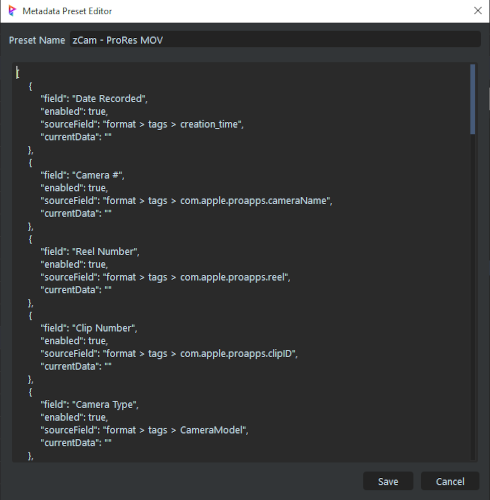

Preset Name must be max 30 chars and use normal symbols

Preset Data - must be valid json


<br>


___
jump to:

[**Installation**](Doc-Installation.md)

[**Settings**](Doc-Settings.md)

[**Interface**](doc-Interface.md)

[**Proxys**](Doc-Proxys.md)

[**File Naming**](Doc-FileNaming.md)
