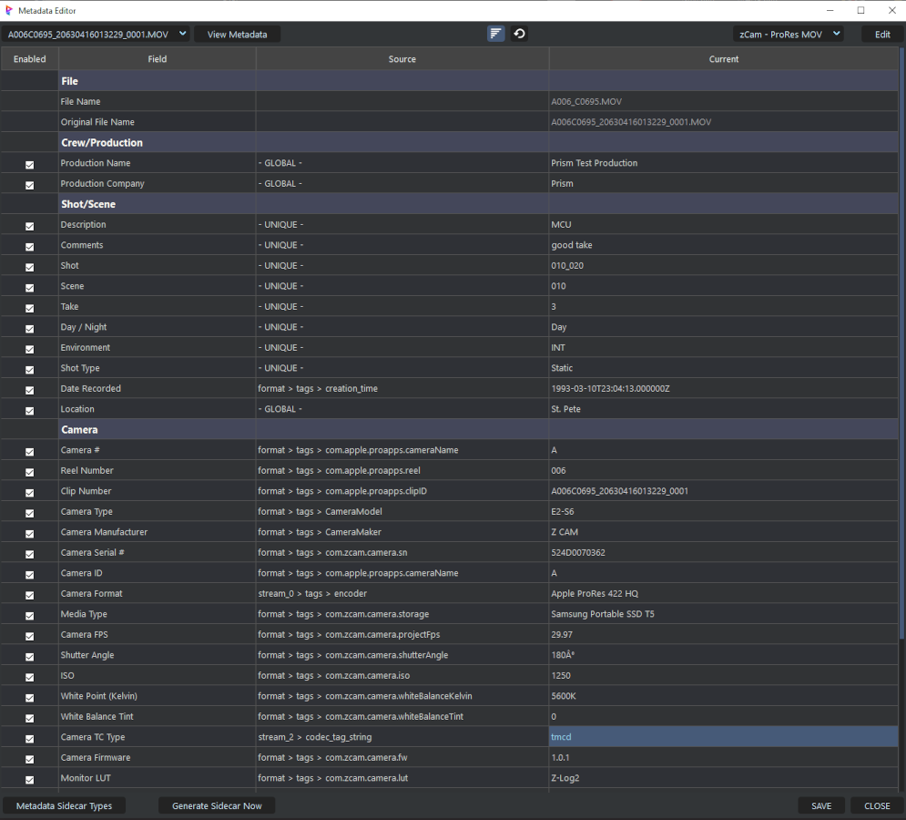

# **Metadata**

 

Unfortunately there is no a standard for Metadata throughout the industry.  

 

### Filters

### Files Dropdown

### Metadata Viewer

___
jump to:

[**Installation**](Doc-Installation.md)

[**Settings**](Doc-Settings.md)

[**Interface**](doc-Interface.md)

[**Proxys**](Doc-Proxys.md)

[**File Naming**](Doc-FileNaming.md)
