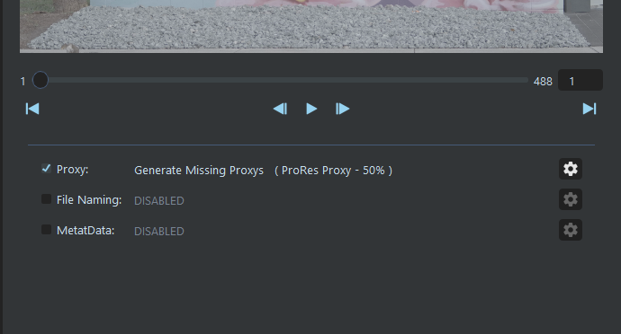
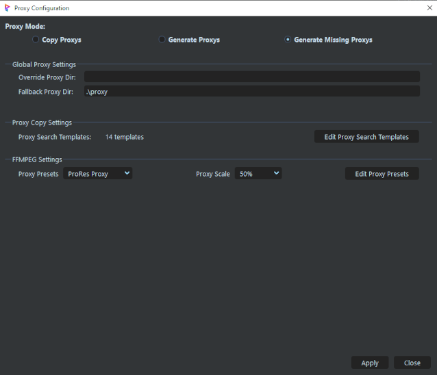
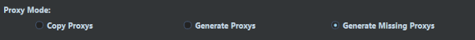
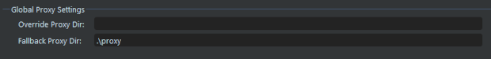
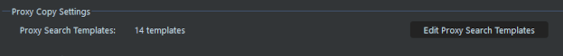
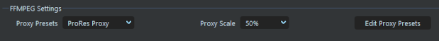
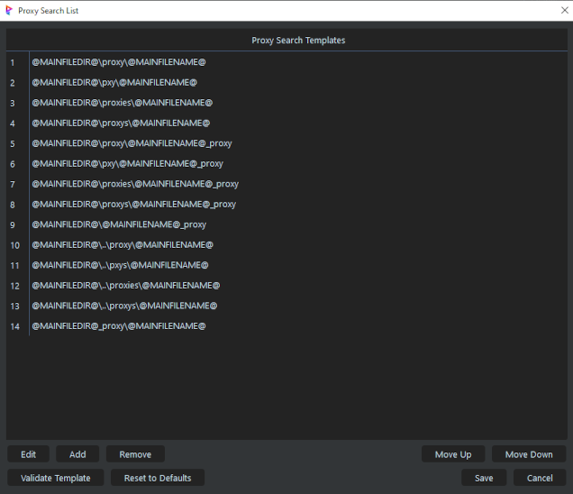
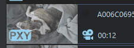
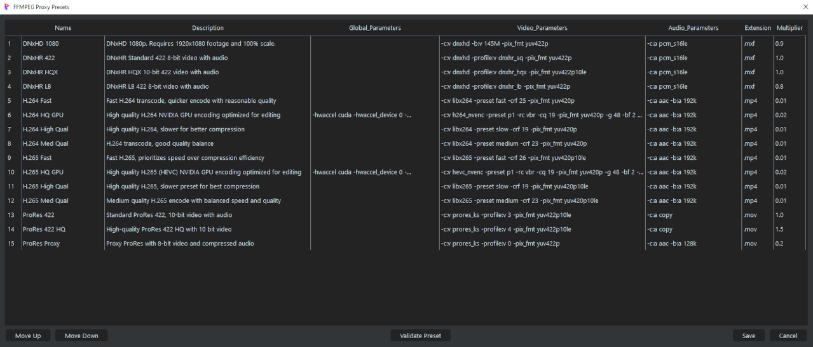
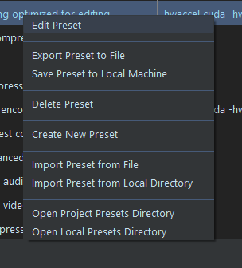

# **Proxys**

<br>

One of the aims of SourceTab to to simplify the handling of Proxys by doing two main things:

**Discovery / Transfer:**  The plugin attempts to discover a video file's associated Proxy by searching adjacent directories ([**see Proxy Search Templates below**](#proxy-search-templates))

**Generation:**  The plugin uses FFmpeg to generate new Proxy files using user defined Proxy Presets ([**see Proxy Presets below**](#proxy-presets)).

___

<br>



Proxy handling is enabled by setting the Proxy checkbox in the SourceTab Functions panel.  The selected Proxy Mode and Preset will be displayed for quick reference.  The cog button is used to configure the Proxy Settings.

<br>

## **Proxy Settings**



This is the main configuration for Proxy handling, and is saved to the Project Settings (pipeline.json).  

<br>

### **Proxy Mode**



This is the per-project Proxy handling mode:

- **Copy Proxys:** Only transfer Proxys that have been discovered by the plugin (noted by the "PXY" icon in the File Tile).  No new Proxys will be generated.

- **Generate Proxys:** Generate new Proxys for each transferred file, based on the FFmpeg Settings. No original Proxys will be transferred.

- **Generate Missing Proxys:** Will transfer any discovered Proxys, or generate new Proxys for files without a discovered Proxy.

```
Generate Missing Proxies is the suggested mode as it covers most cases, both if Source Proxys exist or not.
```

<br>

### **Global Proxy Settings**



These are the Proxy directory settings.  These settings will apply to both transferred Proxys, as well as generated Proxys.

SourceTab will try to resolve and use the same Proxy directory structure in the Destination as the Source structure.  The plugin will try to resolve the relative path of the Proxy files (if they exist).  If there are no Source Proxys or it fails to resolve the structure, Proxys will be saved according to the directories below.

- **Override Proxy Dir:**  This will override the resolved Proxy directory and save/generate Proxys to this directory.  If left blank, the resolved directory will be used (if resolved).

- **Fallback Proxy Dir:**  This is the fallback directory used if the plugin is unable to resolve a Proxy directory, and the Override is not utilized.  This should always be populated with a usable path to stop errors.

```
NOTE: Both relative and absolute path formatting are allowed:

- Relative: standard "dot notation" is utilized to build relative paths such as ./ (current directory) and ../ (parent directory)

- Absolute:  standard filepath style with the full path such as "c:\path\to\dir" or "c:/path/to/dir"
```

<br>

### **Proxy Search Templates**



- These are the path templates where the plugin will search to attempt to discover Proxy files.  Clicking the *Edit Proxy Search Templates* button will open the template editor to allow customization (**see Proxy Search Editor below**).

<br>

### **FFmpeg Settings**



- **Proxy Preset:** Select the Proxy Preset used for generation.

- **Proxy Scale:** The resulting generated Proxy resolution.  This scale is based on the original Source Mainfile resolution.

-  **Edit Proxy Settings:** Open the Preset Editor to configure the Proxy Presets (**see Proxy Preset Editor below**).

```
NOTE: Several Proxy Presets are included with the Plugin, and users are encouraged to create/edit/remove their own presets.
```
<br>

## **Proxy Search Editor**

Proxy Search Templates that will be scanned to attempt to find a Mainfile's associated Proxy.  When a directory is selected in the Source Panel (left-side), all the files in that directory are loaded into File Tiles, and the plugin will use these templates to scan the paths/filenames for associated Proxys. The order of the templates are used for priority, and the scan will stop when a proxy is discovered (for each file).  This ignores the file-extension.



- **Edit:**  Enabled editing of the templates (the templates are normally read-only to avoid accidental edits).

- **Add:**  Add new entry to allow a new user-defined template.

- **Remove:** Delete the currently selected template.

- **Up/Down:** Move the selected template in the list.  The template list order is used during search for priority.

- **Validate:**  Performs a quick sanity check for formatting and errors.

- **Reset to Defaults:**  Completely remove all current templates, and reset to the SourceTab defaults.  This will erase all custom templates added by the user.

- **Save:**  Any changes to the templates must be saved using this button (or choose Cancel to discard).

<br>

This uses relative paths based on the MainFile's directory, and uses standard dot-notation for relative directories:

    ./   - current directory
    ../  - parent directory

The search also uses placeholders to allow the search to find Proxys that have prefixes or suffixes:

@MAINFILEDIR@    @MAINFILENAME@

    Examples:

    - @MAINFILEDIR@\\proxy\\@MAINFILENAME@      -- search in a subdir named "proxy" with same name as the mainfile
    - @MAINFILEDIR@\\@MAINFILENAME@_proxy       -- search in the same dir with the mainfile name with a "_proxy" suffix
    - @MAINFILEDIR@\\..\\proxy\\@MAINFILENAME@" -- search in dir named "proxy" that is at the same level as the main dir

<br>

When an associated Proxy file has been discovered for a video clip, it will be displayed with a "PXY" icon on the File Tile's thumbnail, as well as the Proxy's metadata displayed in the PXY icon's tooltip.



<br>

## **Proxy Presets**

Proxy files can be generated by SourceTab during a transfer if desired.  FFmpeg is used for the generation, and user-editable presets are used to dynamically build the FFmpeg command.  Presets are small text (json) files with an extension **".p_preset"** that contains the FFmpeg commands.  



This lists all the Proxy Presets in the current Prism Project (presets are saved to the project).  Using the right-click menu, Presets can be imported/exported from other projects and shared with other users.  In addition to that, Presets can be saved in a Prism Project Template.

The order of the Presets in the list determines the order in the dropdown.

- **Name:**  The name for the presets.  Used in the menus and will be the preset file name with a ".p_preset" extension.

- **Description:**  Short blurb describing the preset.  Used for reference.

- **Global Params:**  Parameters before the input params.  This may include params such as GPU settings, threading, and logging.

- **Video Params:**  The output video params and must contain standard FFmpeg video params such as the CODEC.

- **Audio Params:**  The output audio params.

- **Extension:**  The desired output file extension (container).  The extension must be compatible with the CODECs in the Video and Audio params.

- **Multiplier:**  This is just the estimated relative size of the generated Proxy to the source file.  It is only used to estimate the resulting Proxy file size for the progress bars and has no affect on the resulting Proxy.  After each transfer, the plugin will calculate the multiplier and update the value in the preset.

- **Move Up/Dn:**  Moves the selected Preset in the list.  This list order is the same order Presets will be displayed in the various places throughout the UI, so a user may move the most frequently used presets to the top.

- **Validate Preset:**  Performs a quick sanity check of the selected Preset.  It will test things such as:
    - Preset Name is valid (max 20 characters and "normal" file system symbols - not allowed: \\ / : * ? \" < > |)
    - FFmpeg executable is valid
    - extension is compatible with the CODEC used
    - the Video and Audio params contain the basic required FFmpeg commands
    - and a quick FFmpeg dry-run is run to check for any encode errors.

<br>

___

### **Right-Click Menu**




Right-clicking in the Proxy Presets window will bring up context menus with extra functionality.

- **Edit Preset:**  Allow editing of the Preset.  By default the Presets are not editable to avoid accidental edits.

- **Export Preset to File:**  Opens File Explorer to save the selected Preset using the Preset name with an extension ".p_preset"

- **Save Preset to Local Machine:**  Saves the selected Preset to the local plugin presets directory.  This allows both backup, and future use in other projects.

- **Delete Preset:**  Deletes the selected Preset from the Project.  If the Preset is in the Local plugin dir or elsewhere, it will not delete those.

- **Create New Preset:**  Inserts a new blank Preset at thew current location.

- **Import Preset from File:**  Opens File Explorer to allow import of a ".p_preset" file.

- **Import Preset from Local Dir:**  Opens the local plugin presets dir to import a Preset.

- **Open Project Presets Dir:**  Opens the Project Presets dir in Explorer.

- **Open Local Presets Dir:**  Opens the local plugin presets dir in Explorer.

<br>

___
jump to:

[**Installation**](Doc-Installation.md)

[**Settings**](Doc-Settings.md)

[**Interface**](Doc-Interface.md)

[**File Naming**](Doc-FileNaming.md)

[**Metadata**](Doc-Metadata.md)