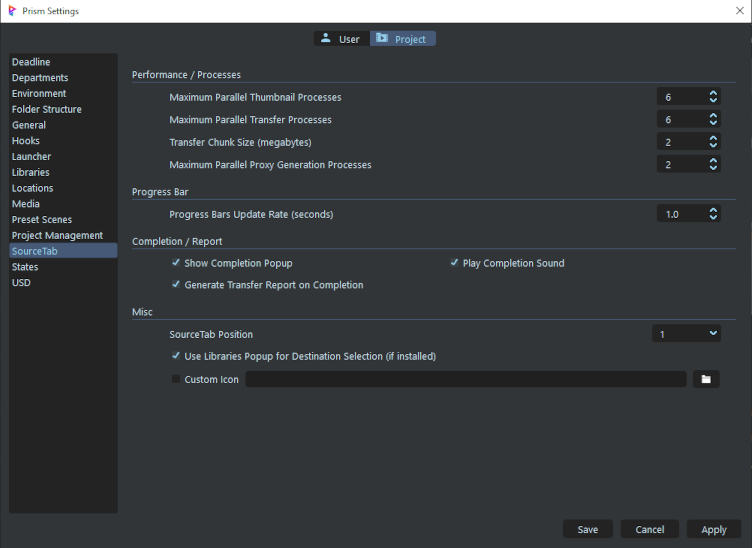
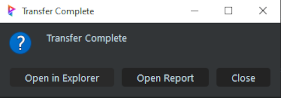
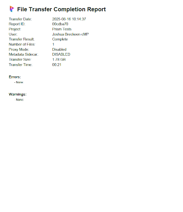
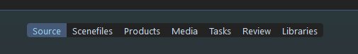
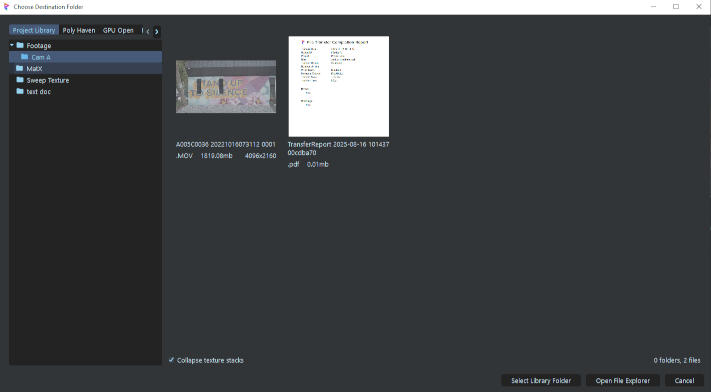
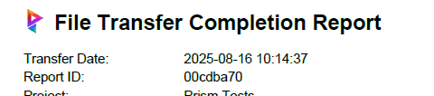

# **SourceTab Project Settings**

 

___

### **Performance / Processes**
These are settings that affect the UI and transfer performance.  The provided defaults seem to work well on most systems, but these settings may be tweaked to gain more performance for differences in machines (CPU, RAM, etc), network speeds, and file type and size.

- **Max Parallel Thumbnail Processes (default = 6)**: The maximum number of separate worker threads allowed for thumbnail generation (FFmpeg instances).  In testing it seems if there are too many threads, FFmpeg may fail to create a thumbnail (may be a Qt issue).

- **Max Parallel Transfer Processes (default = 6)**: The maximum number of transfer worker threads.  Each worker transfers one file at a time, in parallel.  The performance will be based on machine speed, as well as the storage speed and network type.

- **Transfer Chunk Size (default = 2mb)**:  The size of each data block read and written during file transfers. Larger chunks can improve performance on fast systems, while smaller chunks may reduce memory usage and work better on slower or unstable storage.

- **Max Parallel Proxy Generation Processes (default = 2)**:  This plugin uses FFmpeg for Proxy Generation and FFmpeg is multi-threaded by default (on CPU). This means each process should be using all available processor cores (on CPU), thus higher settings do not tend to speed up the generation.  But for GPU proxy generation, higher numbers may work.

___

### **Progress Bar**
 Interval for the UI update refresh in seconds (0.1-100).  This affects how often the the transfer progress is queried and the UI updated.  During an update, each File Tile's progress will be updated, as well as the total progress.

 (default = 1.0)

    Note: Too fast an interval (low number) may cause the UI to lock up on slow machines.
    
 

___

### **Completion / Report**
- **Show Completion Popup**:  Enables a small popup at the end of a transfer with several options.

    

 

- **Play Completion Sound**:  Enables an audio success/failure "beep" at the end of a transfer.

 

- **Generate Report**:  Creates a .pdf transfer report after a transfer is completed. It provides a record of all ingested files, their source and destination paths, verification results (hash), and any errors or skipped items. The report serves as both a confirmation of success and a reference log for future tracking or troubleshooting.

    

 

___

### **Misc**

- **SourceTab Position**:  The position of the tab position in the Project Browser top bar.  For example "1" will place the tab as the first tab (before "Scenefiles").  

    

 

- **Use Libraries Popup**:  If the Libraries plugin is installed, clicking the Destination File Explorer button will launch a custom Libraries window to allow choosing a directory in a Project or Studio Library.

    

 

- **Custom Icon**:  By default, the standard Prism icon is used in the Transfer Report.  But if enabled and selected, a custom icon can be used in place.  The icon should follow "normal" icon requirements (.png, .jpg, .bmp, .gif, .ico, .svg).

    

 

___
jump to:

[**Installation**](Doc-Installation.md)

[**Interface**](doc-Interface.md)

[**Proxys**](Doc-Proxys.md)

[**File Naming**](Doc-FileNaming.md)

[**Metadata**](Doc-Metadata.md)