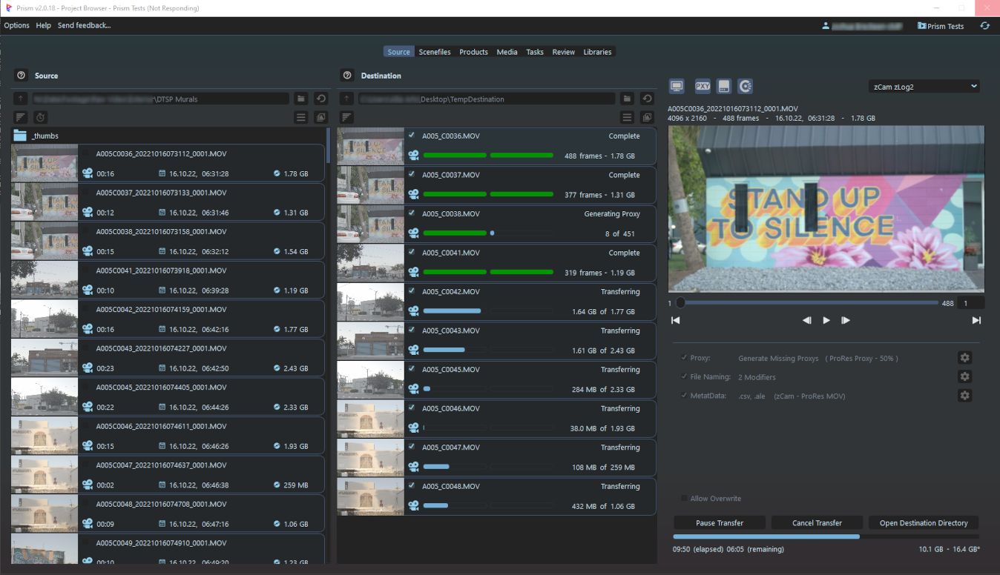

# **SourceTab Plugin for Prism Pipeline 2**
**Adds a "Source" tab to Prism that provides integrated file ingestion.  Adds Proxy handling/generation, File Naming, and Metadata.**

<br>

Prism automates and simplifies the workflow of animation and VFX projects.

You can find more information on the website:

  https://prism-pipeline.com/

<br/>




- Use to speed up the process of ingesting camera original clips (rushes/dailies) into the pipeline.
- Allows quick viewing of a directory of clips with thumbnail and metadata display.
- Drag/drop UI interface for File Tiles ([see **Drag/Drop**](Docs/Doc-Interface.md/#drag--drop))
- Keyboard shortcuts (hotkeys) are provided for common actions ([see **Shortcuts**](Docs/Doc-Interface.md/#keyboard-shortcuts-hotkeys)).
- Mini Preview Viewer for quick review of clips ([see **Preview Player**](Docs/Doc-Interface.md/#preview-player)).
- Transfer Report generated during transfer ([see **Transfer Report**](Docs/Doc-Interface.md/#transfer-report)).
- Metadata sidecar files generation ([see **Sidecars**](Docs/Doc-Metadata.md/#sidecar-generation))
- Automated Proxy search/transfer/generation ([see **Proxys**](Docs/Doc-Proxys.md)).
- Filename modifiers to allow bulk renaming during transfer ([see **File Naming**](Docs/Doc-FileNaming.md)).
- Metadata extraction and assignment using FFprobe and ExifTool ([see **Metadata**](Docs/Doc-Metadata.md)).

<br>

```
NOTE: The name "Proxys" is used throughout this plugin.  Yes technically it should be "Proxies", but I just think Proxys looks better, so there it is.
```

<br/>

## **Installation**

This plugin is for Windows only, as Prism2 only supports Windows at this time.
<br/>

- You can either download the latest stable release version from: [Latest Release](https://github.com/AltaArts/SourceTab--Prism-Plugin/releases/latest)

- Or download the current code zipfile from the green "Code" button above or on [Github](https://github.com/AltaArts/SourceTab--Prism-Plugin)

<br/>

[**Installation Instructions**](Docs/Doc-Installation.md)

<br/>

## **Documentation**

[**Table of Contents / Index**](Docs/Doc-Docs_TOC.md)<br>

[**Settings**](Docs/Doc-Settings.md)<br>
[**Interface**](Docs/Doc-Interface.md)<br>
[**Proxys**](Docs/Doc-Proxys.md)<br>
[**File Naming**](Docs/Doc-FileNaming.md)<br>
[**Metadata**](Docs/Doc-Metadata.md)<br>

<br/>

## **Issues / Suggestions**

For any bug reports or suggestions, please add to the GitHub repo "Issues" or "Projects" tabs.